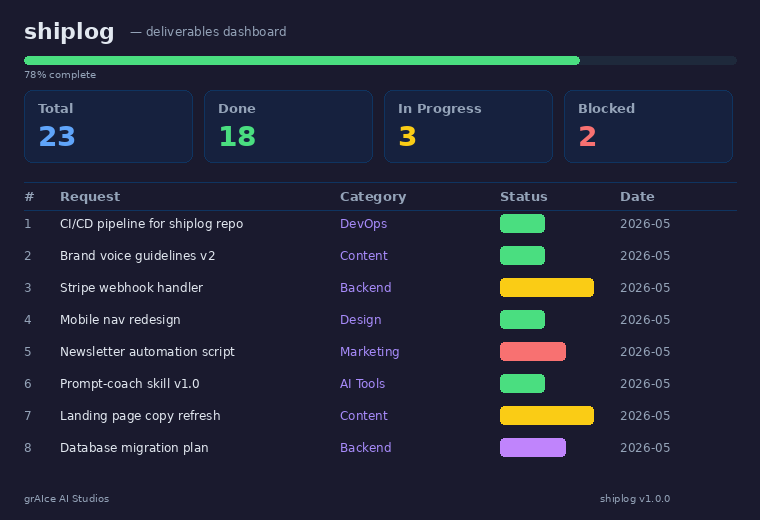

# shiplog

[](LICENSE)
[](CHANGELOG.md)

**Track every Claude deliverable in one dashboard. No server. No database. Just open the file.**



## Install

```bash
curl -O https://raw.githubusercontent.com/grAIcetech/shiplog/main/shiplog.html && open shiplog.html
```

## Features

- **Dark-mode dashboard** with stat cards, progress bar, and status filtering
- **Full-text search** across requests, categories, artifacts, and notes
- **Editable notes** — click any cell to add context, saved to localStorage
- **Markdown export** — one-click `.md` export of the full table
- **Zero dependencies** — no build step, no npm, no framework. One HTML file.
- **Mobile-friendly** — responsive layout with horizontal scroll on small screens

## The Problem

You work with Claude across dozens of sessions. Scripts in one chat, docs in another, deploy checklists in a third. Within a week you can't remember what shipped, what's still open, or where the output landed.

shiplog is a single HTML file that gives you a command center for all of it. Open it in your browser, edit the data array, and you have a filterable, searchable, exportable dashboard with zero setup.

## How to Customize

Open `shiplog.html` in any text editor and find the `DATA` array (look for `// YOUR DATA`):

```javascript
const DATA = [
  {id:1, request:"Your request", category:"Category", status:"Done", date:"2026-05", artifact:"path/or/url", notes:""},
];
```

Categories generate filter buttons automatically. Add a new category string and the button appears.

## File Structure

```
shiplog/
├── shiplog.html                   ← The dashboard (open in any browser)
├── shiplog-dashboard-preview.png  ← Preview screenshot
├── README.md
├── LICENSE
├── CHANGELOG.md
└── .gitignore
```

## Credits

Built by [grAIce Tech](https://github.com/grAIcetech). MIT License.
